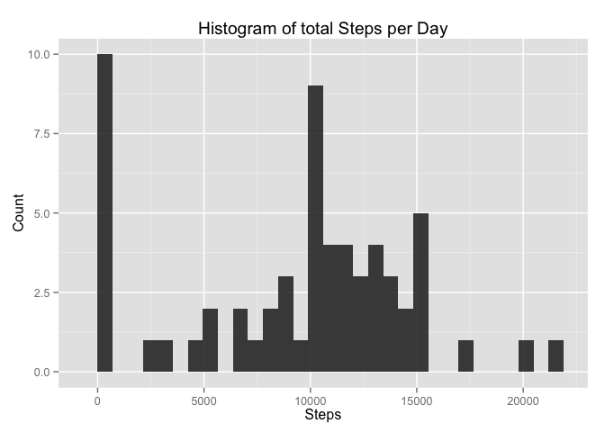
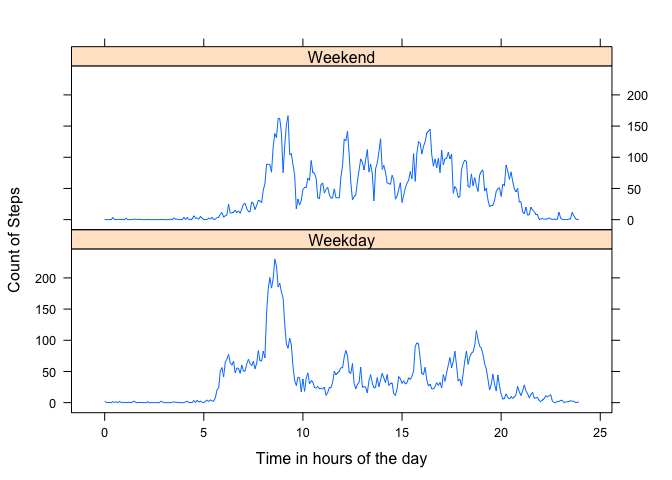

# Reproducible Research: Peer Assessment 1
Andrej Schoeke  


## Loading and preprocessing the data
**1. Load the data (i.e. read.csv())**

```r
unzip(zipfile = "activity.zip")
act_df <- read.csv(file = "activity.csv")
```

**2. Process/transform the data (if necessary) into a format suitable for your analysis**


```r
act_df$date <- as.Date(act_df$date, format = "%Y-%m-%d")
```

## What is mean total number of steps taken per day?
For this part of the assignment, you can ignore the missing values in the dataset.

**1. Calculate the total number of steps taken per day**

```r
library(dplyr)
dailySteps <- act_df %>% 
    group_by(date) %>%
    summarize(totSteps = sum(steps, na.rm = TRUE))

dailySteps
```

```
## Source: local data frame [61 x 2]
## 
##          date totSteps
## 1  2012-10-01        0
## 2  2012-10-02      126
## 3  2012-10-03    11352
## 4  2012-10-04    12116
## 5  2012-10-05    13294
## 6  2012-10-06    15420
## 7  2012-10-07    11015
## 8  2012-10-08        0
## 9  2012-10-09    12811
## 10 2012-10-10     9900
## ..        ...      ...
```
 **2. If you do not understand the difference between a histogram and a barplot, research the difference between them. Make a histogram of the total number of steps taken each day**
 

```r
library(ggplot2)
qplot(dailySteps$totSteps, 
      geom = "histogram", 
      main = "Histogram of total Steps per Day", 
      xlab = "Steps", 
      ylab = "Count",
      alpha=I(.9)
      )
```

 

**3. Calculate and report the mean and median of the total number of steps taken per day**

```r
mean(dailySteps$totSteps, na.rm = T)
```

```
## [1] 9354.23
```

```r
median(dailySteps$totSteps, na.rm = T)
```

```
## [1] 10395
```

## What is the average daily activity pattern?

**1. Make a time series plot (i.e. type = "l") of the 5-minute interval (x-axis) and the average number of steps taken, averaged across all days (y-axis)**

```r
interSteps <- act_df %>%
    group_by(interval) %>%
    summarize(meanSteps = mean(steps, na.rm = T))

# Just using the interval as axis is skewing the result slightly.
# So, we extract the hour
interSteps$time <- floor(interSteps$interval / 100) +
                    # And the minutes and recode it in proper decimals
                    (interSteps$interval - (floor(interSteps$interval / 100))* 100) / 60


ggplot(data = interSteps, aes(x = time, y = meanSteps, group = 1)) +
    geom_line() +
    ggtitle("Average steps taken per five minute interval") +
    xlab("Time in hours") +
    ylab("Number of steps taken") 
```

 

**2. Which 5-minute interval, on average across all the days in the dataset, contains the maximum number of steps?**

```r
interSteps[which.max(interSteps$meanSteps), 1]
```

```
## Source: local data frame [1 x 1]
## 
##   interval
## 1      835
```

```r
# And what is the maximum?
max(interSteps$meanSteps)
```

```
## [1] 206.1698
```

## Imputing missing values

Note that there are a number of days/intervals where there are missing values (coded as NA). The presence of missing days may introduce bias into some calculations or summaries of the data.

**1. Calculate and report the total number of missing values in the dataset (i.e. the total number of rows with NAs)**


```r
# General approach: Get an overview
summary(act_df)
```

```
##      steps             date               interval     
##  Min.   :  0.00   Min.   :2012-10-01   Min.   :   0.0  
##  1st Qu.:  0.00   1st Qu.:2012-10-16   1st Qu.: 588.8  
##  Median :  0.00   Median :2012-10-31   Median :1177.5  
##  Mean   : 37.38   Mean   :2012-10-31   Mean   :1177.5  
##  3rd Qu.: 12.00   3rd Qu.:2012-11-15   3rd Qu.:1766.2  
##  Max.   :806.00   Max.   :2012-11-30   Max.   :2355.0  
##  NA's   :2304
```

```r
# Direct approach: Get only NAs
sum(is.na(act_df))
```

```
## [1] 2304
```

**2. Devise a strategy for filling in all of the missing values in the dataset. The strategy does not need to be sophisticated. For example, you could use the mean/median for that day, or the mean for that 5-minute interval, etc.**


```r
# We already have the average number of steps taken for each five minute 
# interval, so we will use that data.

# Get the row numbers of NAs
rows <- which(is.na(act_df))

# Extract the corresponding intervals
intervals <- act_df[which(is.na(act_df$steps)),3]
NA_info <- data.frame(rows, intervals)

# To each interval assign the mean value for it
NA_info$means <- interSteps$meanSteps[match(NA_info$intervals, interSteps$interval)]
```


**3. Create a new dataset that is equal to the original dataset but with the missing data filled in.**


```r
cleaned_data <- act_df
cleaned_data[NA_info$rows,1] <- NA_info$means
```

**4. Make a histogram of the total number of steps taken each day and Calculate and report the mean and median total number of steps taken per day. Do these values differ from the estimates from the first part of the assignment? What is the impact of imputing missing data on the estimates of the total daily number of steps?**


```r
daySteps <- cleaned_data %>% 
                group_by(date) %>% 
                summarise(sumSteps = sum(steps))

qplot(daySteps$sumSteps, 
      geom = "histogram", 
      main = "Histogram of total Steps per Day", 
      xlab = "Steps", 
      ylab = "Count",
      alpha=I(.9)
      )
```

```
## stat_bin: binwidth defaulted to range/30. Use 'binwidth = x' to adjust this.
```

 

```r
mean(daySteps$sumSteps)
```

```
## [1] 10766.19
```

```r
median(daySteps$sumSteps)
```

```
## [1] 10766.19
```
The values for median and mean increased strongly. The median not as much as the mean, showing it to be more robust against outliers and missing values.

## Are there differences in activity patterns between weekdays and weekends?
For this part the weekdays() function may be of some help here. Use the dataset with the filled-in missing values for this part.

**1. Create a new factor variable in the dataset with two levels -- "weekday" and "weekend" indicating whether a given date is a weekday or weekend day.**


```r
cleaned_data$dayname <- weekdays(cleaned_data$date, abbreviate = T)
cleaned_data$weekday <- "Weekday"
cleaned_data[cleaned_data$dayname %in% c("Sun", "Sat"),5] <- "Weekend"
cleaned_data$weekday <- factor(cleaned_data$weekday)
```


**2. Make a panel plot containing a time series plot (i.e. type = "l") of the 5-minute interval (x-axis) and the average number of steps taken, averaged across all weekday days or weekend days (y-axis).**


```r
library(lattice)

# Plotting intervals again, so let's make a useful variable out of it.
cleaned_data$time <- floor(cleaned_data$interval / 100) + 
    (cleaned_data$interval - (floor(cleaned_data$interval / 100))* 100) / 60

final_plot <- aggregate(cleaned_data$steps, 
                        by = list(Time = cleaned_data$time, 
                                  Weekday = cleaned_data$weekday), 
                        FUN = mean
                        )

xyplot(data = final_plot, x ~ Time | Weekday, type = "l", 
       ylab = "Count of Steps", xlab = "Time in hours of the day", layout = c(1,2))
```

 

People seem to sleep longer on the weekend, but are overall more active over the day. 
